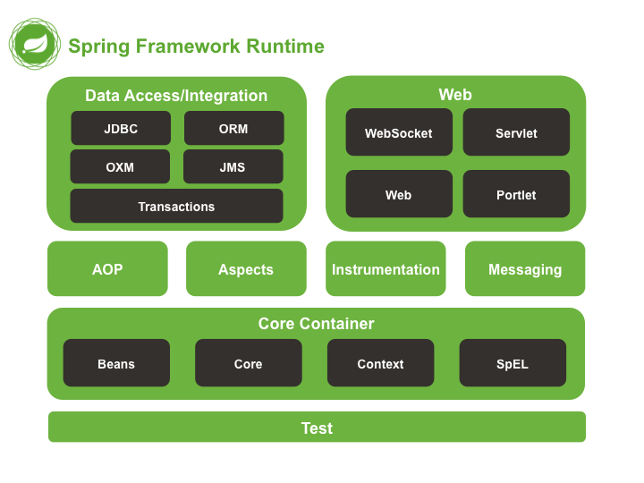

# 1､Spring是什么？

Spring是一个开源框架

Spring为简化企业级应用开发而生的，使用Spring可以使简单的JavaBean实现以前只有EJB才能实现的功能

Spring是一个IOC(ID)和APO容器框架

具体描述Spring：

**轻量级**：**Spring是非侵入性的**-基于Spring开发的应用中的对象可以不依赖于Spring的API

**依赖注入**(DI——dependency injection、IOC)

**面向切面编辑**(AOP——aspect oriented programming)

**容器**：Spring是一个容器，因为它包含并且管理对象的生命周期

**框架**：Spring实现了使用简单的组件配置组合成一个复杂的应用，在Spring中可以使用XML和Java注解组合这些对象

**一站式**：在IOC和AOP的基础上可以整合各种企业应用的开源框架和优秀的第三方类库(实际上Spring自身也提供了展现层的SpringMVC和持久层的Spring JDBC)

Spring模块：



# 2.Spring HelloWorld

```xml
<dependency>
    <groupId>junit</groupId>
    <artifactId>junit</artifactId>
</dependency>

<dependency>
    <groupId>org.springframework</groupId>
    <artifactId>spring-core</artifactId>
</dependency>

<dependency>
    <groupId>org.springframework</groupId>
    <artifactId>spring-beans</artifactId>
</dependency>

<dependency>
    <groupId>org.springframework</groupId>
    <artifactId>spring-context</artifactId>
</dependency>

<dependency>
    <groupId>org.springframework</groupId>
    <artifactId>spring-expression</artifactId>
</dependency>
```

```java
package zzc.spring.beans;

public class HelloWorld {

	public HelloWorld() {
		System.out.println("HelloWorld's Constructor...");
	}

	private String name;

	public void setName(String name) {
		System.out.println("setName： " + name);
		this.name = name;
	}

	public void hello() {
		System.out.println("hello：" + name);
	}
}
```

applicationContext.xml

```xml
<?xml version="1.0" encoding="UTF-8"?>
<beans xmlns="http://www.springframework.org/schema/beans"
       xmlns:xsi="http://www.w3.org/2001/XMLSchema-instance"
       xsi:schemaLocation="http://www.springframework.org/schema/beans http://www.springframework.org/schema/beans/spring-beans.xsd">

    <!-- 配置bean -->
    <bean id="helloWorld" class="zzc.spring.beans.HelloWorld">
        <property name="name" value="Spring"/>
    </bean>
</beans>
```

```java
public class HelloWorldTests {

	@Test
	public void testHello(){
		// 创建HelloWorld的一个对象
		HelloWorld helloWorld = new HelloWorld();
		// 为name属性赋值
		helloWorld.setName("Spring");
		// 调用hello方法
		helloWorld.hello();
	}

	@Test
	public void testHelloSpring(){
		// 1、创建Spring的IOC容器对象
		ApplicationContext ctx = new ClassPathXmlApplicationContext("applicationContext.xml");
		// 2、从IOC容器中获取bean实例
		HelloWorld helloWorld = (HelloWorld) ctx.getBean("helloWorld");
		// 3、调用hello方法
		helloWorld.hello();
	}
}
```

