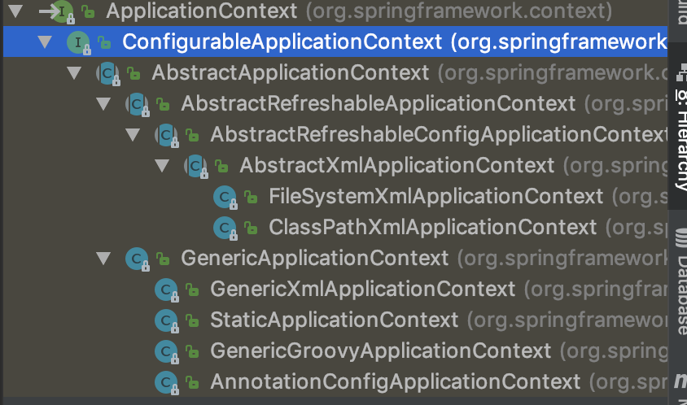
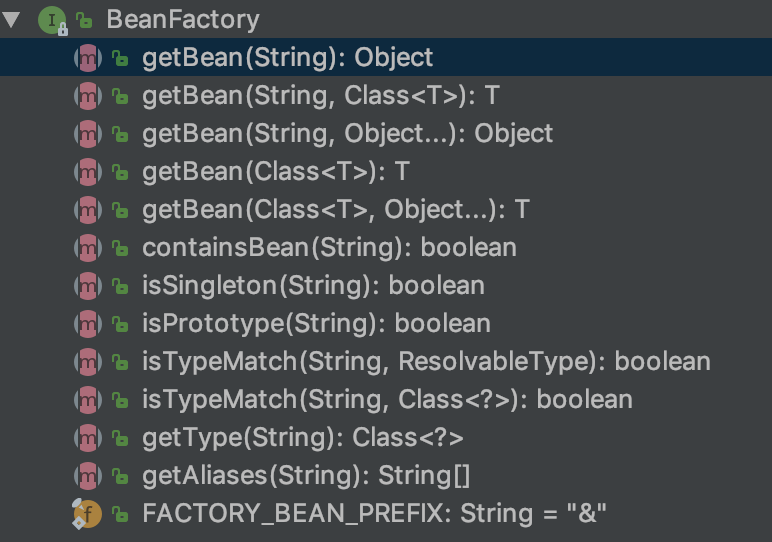

# 1､Spring中的Bean配置

**IOC&DI概述**：

​	IOC(Inverson of Control)：其思想是**反转资源获取的方向**

​	传统的资源查找方式要求组件向容器发起请求查找资源，作为回应，容器适时的返回资源。而应用了IOC之后，则是**容器主动地将资源推送给它所管理的组件，组件所要做的仅是选择一种合适的方式来接受资源**，这种行为也被称为查找的被动形式

​	DI(Dependency Injection)：IOC的另一种表述方式：**即组件以一些预先定义的方式：(例如：setter方法)接受来自容器的资源注入**。相对于IOC而言，这种表述更直接

## 配置bean：

### 	1、配置形式：

​	**在Spring的IOC容器里配置Bea**n

#### 		1､基于XML文件的方式 

​	在XML文件中通过bean节点来配置bean

```xml
<!-- 
class：bean的全类名，通过反射的方式在IOC容器中创建Bean,所以要求bean中必须有无参数的构造器
id：Bean的名称
	在IOC容器中必须是唯一的
	若id没有指定，Spring自动将权限定性类名作为bean的名字
	id可以指定多个名字，名字之间可用逗号、分号、或空格分隔
-->
<bean id="helloWorld" class="zzc.spring.beans.HelloWorld">
    <property name="name" value="Spring"/>
</bean>
```

#### 		2､基于注解的方式

**在classpath中扫描组件**

组件扫描(component scanning)：Spring能够从classpath下自动扫描，侦测和实例化具有特定注解的组件

特定组件包括：

​	@Component：基本注解，标识了一个受Spring管理的组件

​	@Respository：标识持久层组件

​	@Service：标识服务层(业务层)组件

​	@Controller：标识表现层组件

对于扫描到的组件，**Spring有默认的命名策略**，使用非限定类名，第一个字母小写，**也可以在注解中通过value属性标识组件的名称**

当在组件类上使用了特定的注解之后，还需要在Spring的配置文件中声明**<context:component-scan>**:

​	**base-package属性指定一个需要扫描的基类包，Spring容器将会扫描这个基类包里及子包中的所有类**

```java
package zzc.spring.beans.annotation;
@Component
public class TestObject {

}
```

```java
package zzc.spring.beans.annotation.controller;
@Controller
public class UserController {

	public void execute() {
		System.out.println("UserController.execute");
	}

}
```

```java
package zzc.spring.beans.annotation.repository;

public interface UserRepository {

	void save();

}
```

```java
package zzc.spring.beans.annotation.repository;

import org.springframework.stereotype.Repository;

@Repository("userRepository")
public class UserRepositoryImpl implements UserRepository {

	@Override
	public void save() {
		System.out.println("UserRepositoryImpl.save");
	}
}
```

```java
package zzc.spring.beans.annotation.service;

import org.springframework.stereotype.Service;

@Service
public class UserService {

	public void add() {
		System.out.println("UserService.add");
	}
}
```

```xml
<?xml version="1.0" encoding="UTF-8"?>
<beans xmlns="http://www.springframework.org/schema/beans"
       xmlns:xsi="http://www.w3.org/2001/XMLSchema-instance"
       xmlns:context="http://www.springframework.org/schema/context"
       xsi:schemaLocation="http://www.springframework.org/schema/beans http://www.springframework.org/schema/beans/spring-beans.xsd
        http://www.springframework.org/schema/context http://www.springframework.org/schema/context/spring-context-4.0.xsd">

    <!-- 指定IOC容器扫描的包 -->
    <context:component-scan base-package="zzc.spring.beans.annotation"/>

</beans>
```

```java
@Test
public void test01(){
    ClassPathXmlApplicationContext ctx = new ClassPathXmlApplicationContext("beans-annotation.xml");
    TestObject to = (TestObject) ctx.getBean("testObject");
    System.out.println(to);


    UserController userController = (UserController) ctx.getBean("userController");
    System.out.println(userController);

    UserRepository userRepository = (UserRepository) ctx.getBean("userRepository");
    System.out.println(userRepository);


    UserService userService = (UserService) ctx.getBean("userService");
    System.out.println(userService);
}
```


​	**当需要扫描多个包时，可以使用逗号分隔**

​	如果仅希望扫描特定的类而非基包下的所有类，可以使用resource-pattern属性过滤特定的类，示例

```xml
<!-- 指定IOC容器扫描的包 -->
<!-- 可以通过 resource-pattern 指定扫描的资源 -->
<context:component-scan
                        base-package="zzc.spring.beans.annotation"
                        resource-pattern="repository/*.class"/>
```

​	**<context:include-filter>子节点表示要包含的目标类**

```xml
<!-- context:include-filter：子节点指定包含哪些表达式的组件，该子节点需要use-default-filters="false"配合使用 
如不加use-default-filters="false"则zzc.spring.beans.annotation包下的所有的都生效
-->
<context:component-scan base-package="zzc.spring.beans.annotation" use-default-filters="false">
	<context:include-filter type="annotation" expression="org.springframework.stereotype.Repository"/>
</context:component-scan>
```

​	**<context:exclude-filter>子节点表示要排除在外的目标类**

```xml
<!-- context:exclude-filter：子节点指定排除哪些指定表达式的组件-->
<context:component-scan base-package="zzc.spring.beans.annotation" use-default-filters="false">
    <context:exclude-filter type="annotation" expression="org.springframework.stereotype.Repository" />
</context:component-scan>
```

​	<context:component-scan>下可以拥有若干个<context:include-filter>和<context:exclude-filter>子节点

​	<context:include-filter>和<context:exclude-filter>子节点支持多种类型的过滤表达式：

| 类别       | 示例                      | 说明                                                         |
| ---------- | ------------------------- | ------------------------------------------------------------ |
| annotation | org.example.XxxAnnotation | **所有标注了XxxAnnotation的类**。该类型采用目标类是否标注了某个注解进行过滤 |
| assignable | org.example.XxxService    | **所有继承或扩展XxxServices的类**。该类型采用目标类是否继承或扩展某个特定类进行过滤 |
| aspectj    | org.example..*Service+    | 所有类名以Serivce结束的类及继承或扩展它们的类。该类型采用Aspectj表达式进行过滤 |
| regex      | org\.example\.Default.*   | 所有org\.example\.Default包下的类。该类型采用正则表达式根据类的类名进行过滤 |
| custom     | org.example.MyTypeFilter  | 采用XxxTypeFilter通过代码的方式定义过滤规则，该类必须实现org.springframework.core.type.filter.TypeFilter接口 |

**组件装配**：

<context:component-scan>元素还会自动注册AutowiredAnnotationBeanPostProcessor实例，该实例可以自动装配具有**@Autowired**和**@Resource**、**@Inject**注解的属性

**@Autowired自动装配Bean**：

​	使用@Autowired注解自动装配**具有兼容类型**的单个bean属性

​		**构造器，普通字段(即非public)，一切具有参数的方法都可以应用@Autowired注解**

```java
@Service
public class UserService {

	private UserRepository userRepository;

	@Autowired
	public void setUserRepository(UserRepository userRepository) {
		this.userRepository = userRepository;
	}

	public void add() {
		System.out.println("UserService.add");
		userRepository.save();
	}
}
```

​		**默认情况下，所有使用@Autowired注解的属性都需要被设置，当Spring找不到匹配的Bean装配属性时，会抛出异常**，==若某一属性允许不被设置，可以设置@Autowired注解的required属性为false==

```java
public class TestObject {

}
```

```java
@Repository("userRepository")
public class UserRepositoryImpl implements UserRepository {

	@Autowired(required = false)
	private TestObject testObject;

	@Override
	public void save() {
		System.out.println("UserRepositoryImpl.save");
		System.out.println(testObject);
	}
}
```

​		默认情况下，当IOC容器里存在多个类型兼容的Bean时，通过类型的自动装配将无法工作，此时可以在**@Qualifier**注解里提供Bean的名称，**Spring允许对方法的入参标注@Qualifier已指定注入bean的名称**

```java
public interface UserRepository {
	void save();
}
```

```java
@Repository("userRepository")
public class UserRepositoryImpl implements UserRepository {

	@Autowired(required = false)
	private TestObject testObject;

	@Override
	public void save() {
		System.out.println("UserRepositoryImpl.save");
		System.out.println(testObject);
	}
}
```

```java
@Repository
public class UserJdbcRepository implements UserRepository {

	@Override
	public void save() {
		System.out.println("UserJdbcRepository.save");
	}
}
```

```java
@Service
public class UserService {
	
    // UserRepositoryImpl类指定了@Repository("userRepository")和下面定义一样的名字
	// @Autowired
	// private UserRepository userRepository;
    
    // UserRepositoryImpl类指定了@Repository("userRepositoryImpl")
    // @Autowired
    // @Qualifier("userRepositoryImpl")
	// private UserRepository userRepository;
    
    // 还可以写在setter方法上
    // private UserRepository userRepository;
    
    // @Autowired
	// @Qualifier("userRepositoryImpl")
	// public void setUserRepository(UserRepository userRepository) {
		// this.userRepository = userRepository;
	// }
    
    // 写在setter方法入参上
    private UserRepository userRepository;

    @Autowired
	public void setUserRepository(@Qualifier("userRepositoryImpl") UserRepository userRepository) {
		this.userRepository = userRepository;
	}
    
	public void add() {
		System.out.println("UserService.add");
		userRepository.save();
	}
}
```


​		@Autowired注解也可以应用在**数组类型**的属性上，此时Spring将会把所有匹配的Bean进行自动装配

​		@Autowired注解也可以应用在**集合属性**上，此时Spring读取该集合的类型信息，然后自动装配所有与之兼容的bean

​		@Autowired注解用在**java.util.Map**上时，若该Map的键值为String，那么Spring将自动装配与之Map值类型兼容的Bean，此时Bena的名称作为键值 

​	**@Resource或@Inject自动装配Bean**：

​		这两个注解和@Autowired注解的功能类似

​		**@Resource注解要求提供一个Bean名称的属性，若该属性为空，则自动彩用标注处的变量或方法作为Bean的名称**

​		@Inject和@Autowired注解一样也是按类型匹配注入的Bean，但没有required属性

​		**建议使用@Autowired注解**

### 2､Bean的配置方式

#### 	1､通过全类名(反射)

```xml
<bean id="helloWorld" class="zzc.spring.beans.HelloWorld">
    <property name="name" value="Spring"/>
</bean>
```

#### 	2､通过工厂方法

##### 1､静态工厂方法

调用**静态工厂方法**创建Bean是将**对象创建的过程封装到表态方法中**，当客户端需要对象时，只需要简单地调用静态方法，而不用关心创建对象的细节

要声明通过静态方法创建的Bean，需要在Bean的**class**属性里指定拥有该工厂的方法类，同时在**factory-method**属性里指定工厂方法的名称，最后使用<constructor-arg>元素为该方法传递方法参数

```java
public class Car {

	private String brand;
	private double price;

	public Car() {
		System.out.println("Car's Constructor...");
	}

	public Car(String brand, double price) {
		this.brand = brand;
		this.price = price;
	}

	public String getBrand() {
		return brand;
	}

	public void setBrand(String brand) {
		this.brand = brand;
	}

	public double getPrice() {
		return price;
	}

	public void setPrice(double price) {
		this.price = price;
	}

	@Override
	public String toString() {
		return "Car{" +
				"brand='" + brand + '\'' +
				", price=" + price +
				'}';
	}
}
```

```java
/**
 * 静态工厂方法：直接调用某一个类的静态方法，就可以返回bean的实例
 */
public class StaticCarFactory {

	private static Map<String, Car> cars = new HashMap<String, Car>();

	static {
		cars.put("Audi", new Car("Audi", 300000));
		cars.put("Ford", new Car("Ford", 200000));
		cars.put("BaoMa", new Car("BaoMa", 500000));
	}

	// 静态工厂方法
	public static Car getCar(String name) {
		return cars.get(name);
	}

}
```

```xml
<!--
        通过静态工厂方法来配置bean，注意不是配置静态工厂方法实例，而是配置bean实例
        class属性：指向静态工厂方法的全类名
        factory-method：指向静态工厂方法的名字
        constructor-arg：如果工厂方法需要传入参数，则使用constructor-arg来配置参数
    -->
    <bean id="car1" class="zzc.spring.beans.factory.StaticCarFactory" factory-method="getCar">
        <constructor-arg value="Audi"/>
    </bean>
```

```java
@Test
public void testCar() {
    ApplicationContext ctx = new ClassPathXmlApplicationContext("beans-factory.xml");
    Car car = (Car) ctx.getBean("car1");
    System.out.println(car);
}
```

##### 2､实例工厂方法

**实例工厂方法：将对象的创建过程封装到另外一个对象实例的方法里**，当客户需要请求对象时，只需要简单的调用该实例方法而不需要关心对象的创建细节

要声明通过实例工厂方法创建的bean

​	在bean的**factory-bean**属性里指定拥有该工厂方法的bean

​	在**factory-method**属性里指定该工厂方法的名称

​	使用**constructor-arg**元素为工厂方法传递方法参数

```java
/**
 * 实例工厂方法：实例工厂的方法。即先需要创建工厂本身，再调用工厂的实例方法来返回bean的实例
 */
public class InstanceCarFactory {

	private Map<String, Car> cars = null;

	public InstanceCarFactory() {
		cars = new HashMap<String, Car>();
		cars.put("Audi", new Car("Audi", 300000));
		cars.put("Ford", new Car("Ford", 200000));
		cars.put("BaoMa", new Car("BaoMa", 500000));
	}

	public Car getCar(String brand) {
		return cars.get(brand);
	}
}
```

```xml
 <!-- 配置工厂的实例 -->
<bean id="carFactory" class="zzc.spring.beans.factory.InstanceCarFactory"/>

<!--
        通过实例方法来配置bean
        factory-bean属性：指向实例工厂方法的bean
        factory-method：指向实例工厂方法的名字
        constructor-arg：如果工厂方法需要传入参数，则使用constructor-arg来配置参数
    -->
<bean id="car2" factory-bean="carFactory" factory-method="getCar">
    <constructor-arg value="Ford"/>
</bean>
```

```java
@Test
public void testCar2() {
    ApplicationContext ctx = new ClassPathXmlApplicationContext("beans-factory.xml");
    Car car = (Car) ctx.getBean("car2");
    System.out.println(car);
}
```


#### 	3、FactoryBean

```java
package zzc.spring.beans.factorybean;

public class Car {

	private String brand;
	private double price;

	public Car() {
		System.out.println("Car's Constructor...");
	}

	public Car(String brand, double price) {
		this.brand = brand;
		this.price = price;
	}

	public String getBrand() {
		return brand;
	}

	public void setBrand(String brand) {
		this.brand = brand;
	}

	public double getPrice() {
		return price;
	}

	public void setPrice(double price) {
		this.price = price;
	}

	@Override
	public String toString() {
		return "Car{" +
				"brand='" + brand + '\'' +
				", price=" + price +
				'}';
	}
}
```

```java
package zzc.spring.beans.factorybean;

import org.springframework.beans.factory.FactoryBean;

/**
 * 自定义FactoryBean需要实现FactoryBean接口
 */
public class CarFactoryBean implements FactoryBean<Car> {
	private String brand;

	public void setBrand(String brand) {
		this.brand = brand;
	}

	// 返回bean对象
	@Override
	public Car getObject() throws Exception {
		return new Car(brand, 300000);
	}

	// 返回bean的类型
	@Override
	public Class<?> getObjectType() {
		return Car.class;
	}


	@Override
	public boolean isSingleton() {
		return true;
	}
}
```

```xml
 <!--
        通过FactoryBean来配置Bean的实例
        class：指向FactoryBean的全类名
        property：配置FactoryBean的属性

        但实际返回的实例确是FactoryBean的getObject()方法返回的实例
    -->
<bean id="car" class="zzc.spring.beans.factorybean.CarFactoryBean">
    <property name="brand" value="BMW"/>
</bean>
```

```java
@Test
public void testCar() {
    ApplicationContext ctx = new ClassPathXmlApplicationContext("beans-beanfactory.xml");
    Car car = (Car) ctx.getBean("car");
    System.out.println(car);
}
```


### 3、IOC容器BeanFactory&ApplicationContext概述

​	**Spring容器：**

​		在Spring IOC容器读取Bean配置创建Bena实例之前，必须对它进行实例化，只有在容器实例化后，才可以从IOC容器中获取bean实例并使用

​		Spring提供了两种类型的IOC容器实现：

​		**BeanFactory**：IOC容器的基本实现

​		**ApplicationContext**：提供了更多的高级特性，是BeanFactory的子接口

​		BenaFactory是Spring框架的基础设施，面向Spring本身

​		ApplicationContext面向使用Spring框架的开发者，**几乎所有的应用场合都直接使用ApplicationContext而非底层的BeanFactory**

​		无论使用何种方式，配置文件是相同的

​	**ApplicationContext：**



​		ApplicationContext的主要实现类：

​			**ClassPathXmlApplicationContext**：从**类路径下**加载配置文件

​			FileSystemXmlApplicationContext：从文件系统中加载配置文件

​		ConfigurableApplicationContext扩展于ApplicationContext，新增加两个主要方法refresh()和**close()**，让ApplicationContext具有启动、刷新、关闭上下文的能力

​		**ApplicationContext在初始化上下文时就实例化所有单例的bean**

​		WebApplicationContext是专门为WEB应用而准备的，它允许从相对于WEB根目录的路径中完成初始化工作

**从IOC容器中获取Bean**:



```java
@Test
public void testHello(){
    // 1、创建Spring的IOC容器对象
    // ApplicationContext 代表IOC容器
    // ClassPathXmlApplicationContext：是ApplicationContext 接口的实现类，该实现类从类路径下加载配置文件
    ApplicationContext ctx = new ClassPathXmlApplicationContext("applicationContext.xml");
    // 2、从IOC容器中获取bean实例
    // 利用id定位到IOC容器中bean
    HelloWorld helloWorld = (HelloWorld) ctx.getBean("helloWorld");
    // 3、调用hello方法
    helloWorld.hello();
}
```

```java
	@Test
	public void testHelloSpringType(){
		// 1、创建Spring的IOC容器对象
		// ApplicationContext 代表IOC容器
		// ClassPathXmlApplicationContext：是ApplicationContext 接口的实现类，该实现类从类路径下加载配置文件
		ApplicationContext ctx = new ClassPathXmlApplicationContext("applicationContext.xml");
		// 2、从IOC容器中获取bean实例
		// org.springframework.beans.factory.NoUniqueBeanDefinitionException 定义多个bean会报错
		// 利用类型返回 IOC容器中的bean，但要求IOC容器中必须只能有一个该类型的Bean
		HelloWorld helloWorld = ctx.getBean(HelloWorld.class);
		// 3、调用hello方法
		helloWorld.hello();
	}
```
