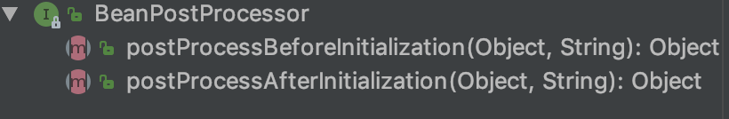

# IOC容器中Bean的生命周期方法

**Spring IOC容器可以管理Bean的生命周期**，Spring允许在Bean生命周期的特定点执行定制的任务

Spring IOC容器对Bean的生命周期进行管理的过程：

​	通过构造器或工厂方法创建Bean实例

​	为Bean的属性设置值和对其他Bean的引用

​	**调用Bean的初始化方法**

​	Bean可以使用了

​	**当容器关闭时，调用Bean的销毁方法**

在Bean的声明里设置init-method和destroy-method属性，为Bean指定初始化和销毁方法

```java
public class Car {

	public Car() {
		System.out.println("Car's constructor...");
	}

	private String brand;

	public void setBrand(String brand) {
		System.out.println("setBrand...");
		this.brand = brand;
	}

	public void init() {
		System.out.println("init...");
	}


	public void destroy() {
		System.out.println("destroy...");
	}

	@Override
	public String toString() {
		return "Car{" +
				"brand='" + brand + '\'' +
				'}';
	}
}
```

```xml
<bean id="car" class="zzc.spring.beans.Car" init-method="init" destroy-method="destroy">
    <property name="brand" value="Audi"/>
</bean>
```

```java
@Test
public void testCar() {
    ClassPathXmlApplicationContext ctx = new ClassPathXmlApplicationContext("applicationContext.xml");
    Car car = (Car) ctx.getBean("car");
    System.out.println(car);
    // 关闭IOC容器
    ctx.close();
}
```

# 创建Bean后置处理器

**Bean后置处理器允许在调用初始化方法前后对Bean进行额外的处理**

**Bean后置处理器对IOC容器里的所有Bean实例逐一处理**，而非单一实例，其典型应用是：检查Bean属性的正确性或根据特写的标准更改Bean的属性

对Bean后置处理器而言，需要实现BeanPostProcessor接口，在初始化方法被调用前后，Spring将把每个Bean实例分别传递给上述接口的以下两个方法:



```java
public class MyBeanPostProcessor implements BeanPostProcessor {

	public Object postProcessBeforeInitialization(Object bean, String beanName) throws BeansException {
		System.out.println("MyBeanPostProcessor.postProcessBeforeInitialization: " + bean + ", " + beanName);
		return bean;
	}

	public Object postProcessAfterInitialization(Object bean, String beanName) throws BeansException {
		System.out.println("MyBeanPostProcessor.postProcessAfterInitialization: " + bean + ", " + beanName);
		return bean;
	}
}
```

```java
public class MyBeanPostProcessor implements BeanPostProcessor {

	public Object postProcessBeforeInitialization(Object bean, String beanName) throws BeansException {
		System.out.println("MyBeanPostProcessor.postProcessBeforeInitialization: " + bean + ", " + beanName);
		if ("car".equals(beanName)) {
			//...
		}
		return bean;
	}

	public Object postProcessAfterInitialization(Object bean, String beanName) throws BeansException {
		System.out.println("MyBeanPostProcessor.postProcessAfterInitialization: " + bean + ", " + beanName);
		Car car = new Car();
		car.setBrand("Ford");
		return car;
	}
}
```

```xml
<!--
        实现BeanPostProcessor接口，并具体提供
        Object postProcessBeforeInitialization(Object bean, String beanName)：init-method 之前被调用
        Object postProcessAfterInitialization(Object bean, String beanName)：init-method 之后被调用
        的实现

        bean：bean实例本身
        beanName： IOC容器配置的bean的名字
        返回值：是实际上返回给用户的那个bean，注意：可以在以上两个方法中修改返回的bean，甚至返回一个新的bean
     -->
    <!-- 配置bean的后置处理器：不需要配置id，IOC 容器自动识别是一个BeanPostProcessor后置处理器 -->
    <bean class="zzc.spring.beans.MyBeanPostProcessor"/>
```

# 添加Bean后置处理器后Bean的生命周期

Spring IOC容器对Bean的生命周期进行管理的过程：

​	通过构造器或工厂方法创建Bean实例

​	为Bean的属性设置值和对其他Bean的引用

​	**将Bean实例传递给Bean后置处理器的postProcessBeforeInitialization方法**

​	调用Bean的初始化方法

​	**将Bean实例传递给Bean后置处理器的postProcessAfterInitialization方法**

​	Bean可以使用了

​	当容器关闭时，调用Bean的销毁方法